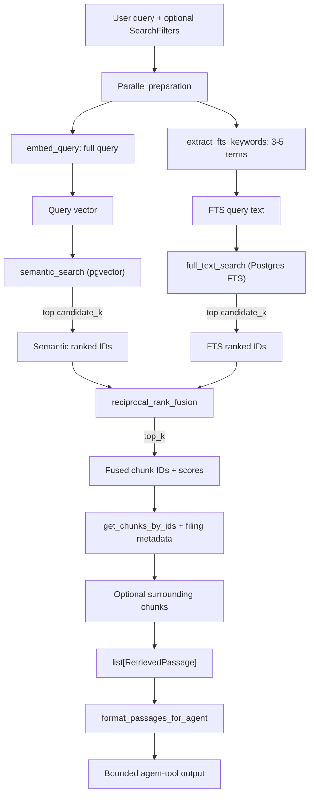

# Retrieval

Hybrid search over SEC filing chunks stored in Supabase Postgres. Each query runs semantic (pgvector) and keyword (Postgres full-text) searches in parallel, fuses their rankings with Reciprocal Rank Fusion (RRF), and returns matching chunks with filing metadata and optional neighboring context.

For the full path from an analyst question through agent tools and grounding validation, see [`../assistant/README.md`](../assistant/README.md).

## Pipeline



### How a search runs

1. **Prepare in parallel.** `embed_query` embeds the full user query. At the same time, `extract_fts_keywords` derives 3-5 useful FTS terms, unless the query is already short and keyword-like. Filters are provided to keyword extraction so it can omit redundant company names.
2. **Search in parallel.** `_dual_search` runs semantic and full-text queries in separate database sessions. Semantic search orders chunks by pgvector cosine distance (`<=>`) and returns `1 - distance` as its score. Full-text search uses `plainto_tsquery` against the ingest-generated `search_vector` and ranks with `ts_rank_cd`.
3. **Fuse.** `reciprocal_rank_fusion` combines both ranked ID lists. Each occurrence at 1-based rank `r` adds `1 / (k + r)` to the chunk score; the sorted result is truncated to `top_k`.
4. **Hydrate.** `DocumentRetriever` loads complete chunk and parent-document rows in fused order.
5. **Attach context.** With neighbors enabled, adjacent chunks from the same filing are attached to their primary passage and deduplicated across hits.
6. **Format.** `format_passages_for_agent` produces bounded, grep-style text for tools and smoke-test output.

## Default settings

All retrieval tuning is defined in `app/config.py`. Pydantic Settings permits environment-variable overrides using the upper-case field name; for example, `RETRIEVAL_TOP_K=15`.

| Setting | Default | Role |
| --- | --- | --- |
| `retrieval_candidate_k` | `50` | Maximum hits fetched from each search path before fusion |
| `retrieval_top_k` | `10` | Final number of fused primary passages |
| `retrieval_rrf_k` | `60` | RRF constant in `1 / (k + rank)` |
| `retrieval_neighbor_radius` | `1` | Chunks before and after each hit to attach, by `chunk_index` |
| `retrieval_fts_config` | `"english"` | Postgres text-search configuration for `plainto_tsquery` |
| `retrieval_fts_keyword_model` | `"gpt-4.1-mini"` | Model used to extract FTS keywords |
| `retrieval_fts_keyword_min` | `3` | Minimum usable extracted terms before deterministic fallback |
| `retrieval_fts_keyword_max` | `5` | Maximum keyword word budget |
| `retrieval_fts_keyword_fast_path_tokens` | `5` | Query token count at or below which keyword extraction skips the LLM |
| `openai_embedding_model` | `"text-embedding-3-small"` | Model used for query embeddings |
| `openai_embedding_dimensions` | `1536` | Embedding width; must match ingested chunk vectors |

### `DocumentRetriever.search` parameters

| Parameter | Default | Role |
| --- | --- | --- |
| `filters` | `None` | Optional `SearchFilters` applied to both search paths |
| `top_k` | `settings.retrieval_top_k` | Overrides the number of fused passages |
| `candidate_k` | `settings.retrieval_candidate_k` | Overrides the candidate pool for each search path |
| `include_neighbors` | `True` | Attaches nearby chunks to each primary result |
| `session` | auto-created | Uses the supplied SQLAlchemy session or opens one for the search |

### Agent output limits

| Constant | Value | Role |
| --- | --- | --- |
| `MAX_PASSAGE_EXCERPT_CHARS` | `800` | Maximum characters for each primary passage or neighbor excerpt |
| `MAX_AGENT_OUTPUT_CHARS` | `12_000` | Maximum total characters returned by `format_passages_for_agent` |

## Filters and returned passages

`SearchFilters` narrows both semantic and full-text search. Specified fields are combined with `AND`; unset fields do not filter results.

| Field | Type | SQL effect |
| --- | --- | --- |
| `ticker` | `str \| None` | `sd.ticker = :ticker` |
| `fiscal_years` | `list[int] \| None` | `sd.fiscal_year = ANY(:fiscal_years)` |
| `form` | `str \| None` | `sd.form = :form` |

Each `RetrievedPassage` includes the matching chunk and fusion score plus its filing context: ticker, company name, form, filing date, fiscal year, accession number, page, and section. When enabled, neighboring chunks are nested on the primary passage with a `fusion_score` of `0.0`.

## Module map

| File | Responsibility |
| --- | --- |
| `retriever.py` | `DocumentRetriever`: prepare, search, fuse, hydrate, and attach neighbors |
| `embeddings.py` | OpenAI query embedding |
| `keywords.py` | LLM keyword extraction and deterministic fallback |
| `queries.py` | pgvector semantic search and Postgres full-text SQL |
| `fusion.py` | Reciprocal Rank Fusion |
| `types.py` | Shared retrieval models and agent-output formatting |

## Quick smoke test

From `backend/`:

```bash
uv run python -m scripts.smoke_retrieval
```

The script runs three ticker-scoped 10-K questions through `DocumentRetriever` and prints `format_passages_for_agent` output. It requires the normal backend configuration, a reachable database, and OpenAI credentials.

## RRF in brief

Given rankings `[semantic_ids, fts_ids]` and constant `k`:

```text
score(chunk) = sum(1 / (k + rank_in_list))
```

A chunk that ranks well in both lists receives a higher score than one that appears in only one list. The default `k=60` dampens the difference between the very top ranks and lower ranks.
